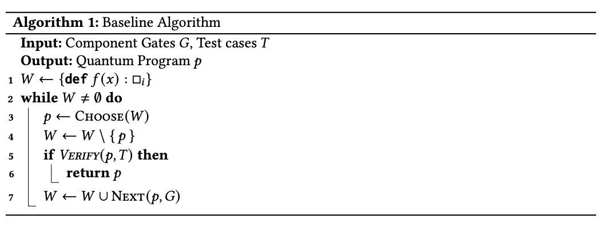
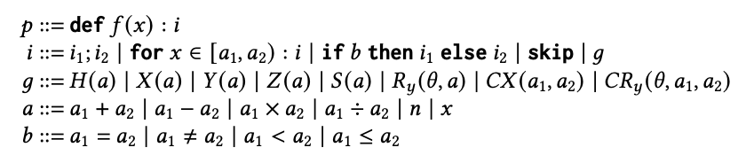

# Quantum Program Synthesis (Qupsy)

Qupsy is a tool for **quantum program synthesis**: given a set of input/output quantum state test cases, it automatically generates a quantum program to satisfy those specifications.

---

## 🚀 Getting Started

### Running the Tool

Use the following command to synthesize a quantum program:

```bash
python qpsynth.py [specification_path] [search_mode: baseline]
# Example: python qpsynth.py benchmarks/ghz.json baseline
```

- **specification_path**: Path to the `.json` specification file (see below).
- **search_mode**: Choice of algorithm: 
  - `baseline`: simple baseline search

---

## 📄 Specification File Format

Your specification **MUST** be a JSON file with the following structure:

- **`gates`** (optional):  
  List of gate names to use in synthesis (if omitted, all available gates are used).  
  Available gates:`H`, `X`, `Y`, `Z`, `Ry`, `CX`, `CY`, `CZ`, `CRy`  
  You can define more gates in `QPSynthesis/synthesizer/language.py`.
- **`examples`**:
    - **`qubit`**: Number of qubits
    - **`input`** (optional): Comma-separated real/complex amplitudes for initial state $|\text{in}\rangle$. Defaults to $|0\dots0\rangle$.
    - **`output`**: Comma-separated real/complex amplitudes for the expected output $|\text{out}\rangle$.

### Example Specification

```json
{
  "gates": ["H", "CX"],
  "examples": {
    "1": {
      "qubit": "3",
      "output": "0.70710677,0,0,0,0,0,0.70710677,0"
    },
    "2": {
      "...": "..."
    }
  }
}
```

*See more examples in* `benchmarks/specification/`.

---

## 🗂️ Overview of Key Modules

Modules are under QPSynthesis/synthesizer/ path.

- **`search.py`**  
  Implements search algorithms:  
  - `search_base`: Baseline algorithm 
  
  <div align="center">
      
  </div>

- **`language.py`**  
  Defines the quantum small language to synthesize a quantum program.

  <div align="center">
    
  </div>

- **`worklist.py`**  
  Priority queue (worklist) data structure for candidate program states during search.

- **`transition.py`**  
  Defines the transition relation—how current candidate programs evolve into next candidates.

- **`prune.py`**  
  Implements several **pruning strategies** to speed up synthesis and reduce search space:  

  <div align="center">
    
    
  </div>
